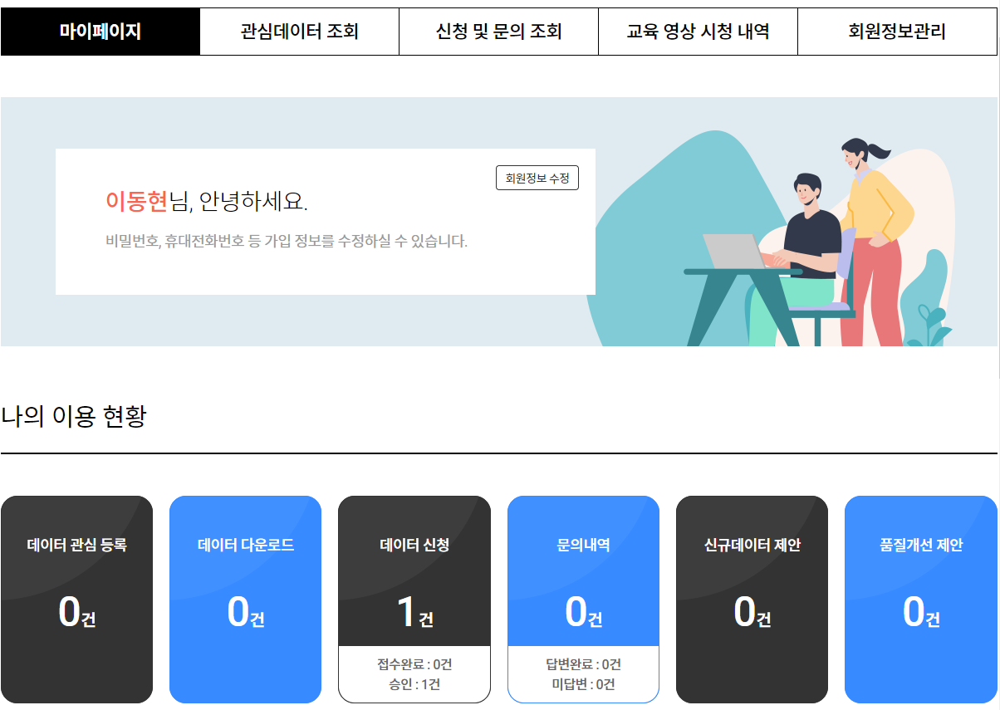
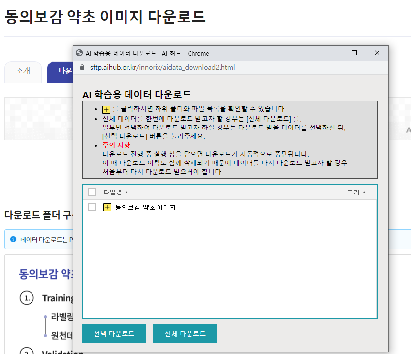
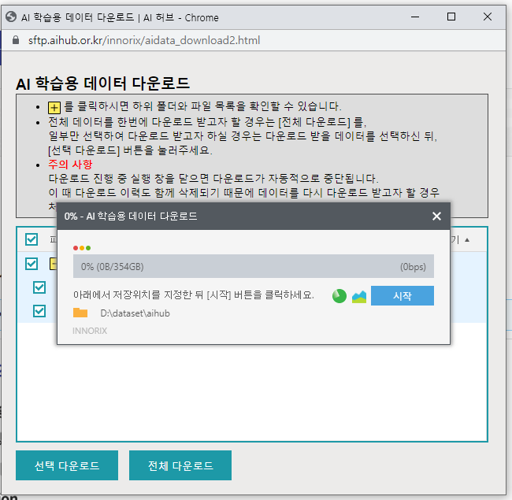
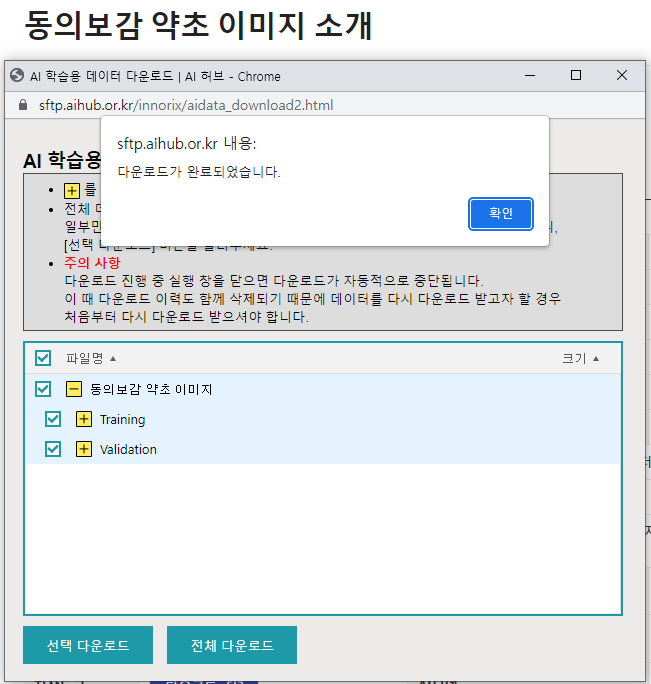

## How to get the data (Korean only)

1. Go to [this link (AI-Hub)](https://aihub.or.kr/aihubdata/data/view.do?currMenu=115&topMenu=100&aihubDataSe=realm&dataSetSn=151).

1. Login & submit a request.

   

1. Install data downloader & run it.

   

1. Select all data and click download button.

   

1. Finished! Unzip downloaded files.

   
  